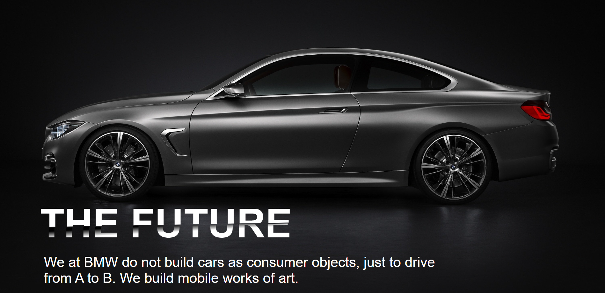

# OasisInfobyte_task1_BMW

# BMW Car Showcase

This is a simple webpage layout for showcasing BMW cars. It includes various sections with images and text to provide information about the BMW brand and its vehicles.

## Technologies Used

- HTML
- CSS

## Getting Started

To get a local copy of the project, you can follow these steps:

1. Clone the repository:

```
git clone https://github.com/your-username/bmw-car-showcase.git
```

2. Open the `index.html` file in your web browser.

## Features

- Display of the BMW logo and animated text using CSS gradients and clip paths.
- Responsive layout that adapts to different screen sizes.
- Showcase of BMW cars with images and descriptions.
- Stylish button for the user to experience more.

## Screenshots





## Contributing

Contributions to this project are welcome. If you find any issues or would like to add new features, please feel free to submit a pull request.


## Acknowledgements

- The BMW logo and car images used in this project are for demonstration purposes only and belong to their respective owners.
- The code for the animated text effect was inspired by [Codepen](https://codepen.io/).

## Contact

For any inquiries or feedback, please contact Nithin Sai Choudary at nithinchoudaryjampala@gmail.com.

Feel free to customize this README file according to your specific project and include any additional sections or information that may be relevant.
